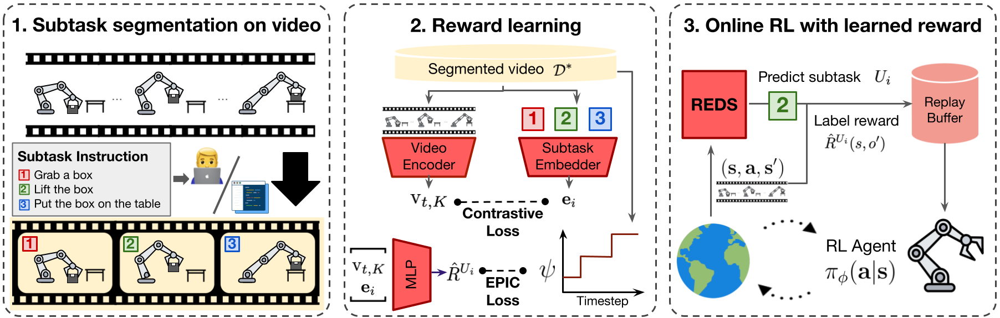

<h1 align="center"> Subtask-Aware Visual Reward Learning<br>from Segmented Demonstrations
</h1>

<div align="center">
  <a href="https://changyeon.site/" target="_blank">Changyeon&nbsp;Kim</a><sup>1</sup> &ensp; <b>&middot;</b> &ensp;
  <a href="https://minoring.github.io/" target="_blank">Minho&nbsp;Heo</a><sup>1</sup> &ensp; <b>&middot;</b> &ensp;
  <a href="https://dhleekr.github.io/" target="_blank">Doohyun&nbsp;Lee</a><sup>1</sup> &ensp; <b>&middot;</b> &ensp;
  <br>
  <a href="https://web.eecs.umich.edu/~honglak/" target="_blank">Honglak&nbsp;Lee</a><sup>2,3</sup>&ensp; <b>&middot;</b> &ensp;
  <a href="https://alinlab.kaist.ac.kr/shin.html" target="_blank">Jinwoo&nbsp;Shin</a><sup>1</sup>&ensp; <b>&middot;</b> &ensp;
  <a href="https://clvrai.com/web_lim/" target="_blank">Joseph&nbsp;J.&nbsp;Lim</a><sup>1*</sup>&ensp; <b>&middot;</b> &ensp;
  <a href="https://sites.google.com/view/kiminlee" target="_blank">Kimin&nbsp;Lee</a><sup>1*</sup><br>
  <sup>1</sup> KAIST &ensp; <sup>2</sup>University of Michigan &ensp; <sup>3</sup>LG AI Research &ensp; <br>
  <sup>*</sup>Equal Advising &ensp; <br>
</div>
<h3 align="center">[<a href="https://changyeon.site/reds">project page</a>]&ensp;[<a href="http://arxiv.org/abs/2502.20630">arXiv</a>]</h3>
<br>



<b>Summary</b>: We propose **REDS: Reward learning from Demonstration with Segmentations**, a new reward learning framework that leverages action-free videos with minimal supervision by treating segmented video demonstrations as ground-truth rewards.

### 1. Install dependencies
#### Create miniconda environment
```
conda create -n reds python=3.10
conda activate reds
```

#### Install reward learning repository
```
../
git clone https://github.com/csmile-1006/REDS_reward_learning.git
cd REDS_reward_learning
pip install -r requirements.txt
pip install -e .
```

#### Install dependencies
```
cd ../REDS_agent
pip install -r requirements.txt
pip install pre-commit
pre-commit install
```


### 2. Downloading Data

#### Meta-world
Download Meta-world expert dataset with the following [link](https://drive.google.com/file/d/1-bHF4b9dvST5c9_9iLniimVzRbbHnW37/view?usp=sharing).

#### RLBench
First, install [RLBench](https://github.com/stepjam/RLBench) by following the instructions in the repository.\
Next, download expert dataset with the following [link](https://drive.google.com/file/d/1C8tF6L6-Zyhv1oJWwABcoog8KmZZrg8W/view?usp=sharing)

Make the folder structure as follows:
```
{BASE_PATH}
├── {TASK_TYPE:=metaworld or rlbench}_data
├── REDS_agent
└── REDS_reward_learning
```


### 3. Reward Model Training

Use the following command to first train REDS reward model:
```python
python scripts/train_reds_metaworld.sh {TASK_NAME} {ITERATION} {DEVICE} {REWARD_TRAINING_STEPS} {DREAMER_TRAINING_STEPS} {NUM_DEMOS} {NUM_FAILURE_DEMOS} {BASE_PATH}

python scripts/train_reds_rlbench.sh {TASK_NAME} {ITERATION} {DEVICE} {REWARD_TRAINING_STEPS} {DREAMER_TRAINING_STEPS} {NUM_DEMOS} {NUM_FAILURE_DEMOS} {BASE_PATH}

# Default parameters:
# ITERATION=2
# REWARD_TRAINING_STEPS=3000
# DREAMER_TRAINING_STEPS=100000
# NUM_DEMOS=50 (for metaworld) or 100 (for rlbench)
# NUM_FAILURE_DEMOS=50 (for metaworld) or 100 (for rlbench)
```

After reward model training, the folder structure is as follows:
```
{BASE_PATH}
├── {TASK_TYPE:=metaworld or rlbench}_data
├── REDS_agent
├── REDS_reward_learning
├── pretrain_dreamerv3
└── reds_logdir
```

### 4. Policy Training
#### Meta-world
```python
DEVICE_ID=0 TASK_NAME=door-open SEED=0 && XLA_PYTHON_CLIENT_PREALLOCATE=false LD_PRELOAD="" CUDA_VISIBLE_DEVICES=${DEVICE_ID} python scripts/train_dreamer.py \
    --configs=reds_prior_rb metaworld \
    --reward_model_path=${BASE_PATH}/reds_logdir/REDS/metaworld-${TASK_NAME}/${TASK_NAME}-phase2/s0/last_model.pkl \
    --logdir=${BASE_PATH}/exp_local/${TASK_NAME}_reds_seed${SEED} \
    --task=metaworld_${TASK_NAME} \
    --env.metaworld.reward_type=sparse \
    --seed=${SEED}
```

#### RLBench
```python
DEVICE_ID=0 TASK_NAME=take_umbrella_out_of_umbrella_stand SEED=0 && XLA_PYTHON_CLIENT_PREALLOCATE=false DISPLAY=:0.${DEVICE_ID} CUDA_VISIBLE_DEVICES=${DEVICE_ID} python scripts/train_dreamer.py \
  --configs=reds_prior_rb rlbench \
  --reward_model_path=${BASE_PATH}/reds_logdir/REDS/rlbench-${TASK_NAME}/${TASK_NAME}-phase2/s0/last_model.pkl \
  --logdir=${BASE_PATH}/exp_local/${TASK_NAME}_reds_seed${SEED} \
  --task=rlbench_${TASK_NAME} \
  --env.rlbench.reward_type=sparse \
  --seed=${SEED} \
  --num_demos=0 \
  --env.rlbench.actions_min_max_path=${BASE_PATH}/rlbench_data/ \
  --reward_model_scale=0.005
```

## BibTeX
```
@inproceedings{kim2025subtask,
  title={Subtask-Aware Visual Reward Learning from Segmented Demonstrations},
  author={Kim, Changyeon and Heo, Minho and Lee, Doohyun and Shin, Jinwoo and Lee, Honglak and Lim, Joseph J. and Lee, Kimin},
  booktitle={International Conference on Learning Representations (ICLR)},
  year={2025},
}
```


## Acknowledgments

Our code is based on the implementation of [VIPER](https://github.com/alescontrela/reds_rl).

